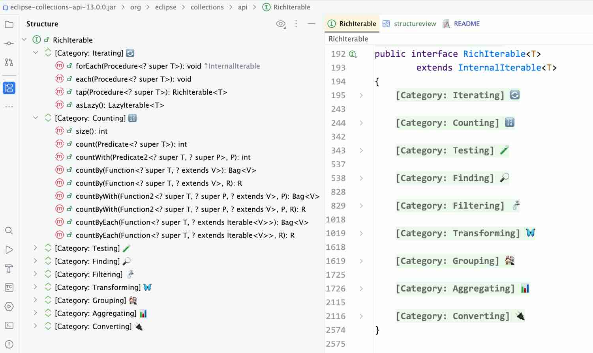

== Resources for Eclipse Collections Categorically Book

=== Method Categories in Java and JavaDoc
The book link:https://donraab.medium.com/book-eclipse-collections-categorically-37591b2135f5?source=friends_link&sk=03cc75fec4052e377444ede49d6c55b2["Eclipse Collections Categorically: Level up your programming game"] introduces the idea of using method categories to organize feature-rich Java APIs so they are easier to learn and comprehend. The link:https://github.com/eclipse-collections/eclipse-collections/blob/master/eclipse-collections-api/src/main/java/org/eclipse/collections/api/RichIterable.java[source code] and JavaDoc for the `RichIterable` class has been updated in the Eclipse Collections 12.0 release to emulate method categories. When using Eclipse Collections 12.0 or above in IntelliJ IDEA, the structure view and source view will show the method categories for `RichIterable` when browsing the source. See the image below showing RichIterable in the structure view (left pane) and source view (right pane).

=== Source Code Examples
The following _Table of Contents_ contains a full index of all the example numbers with unit test names included in the chapters of the _Eclipse Collections Categorically_ book. There are two *sample* source code examples linked from each chapter of the book. The samples are JUnit 5 tests that can be executed. When you compile and run the tests, there should be `*22*` passing tests.

Some of the tests use the shared domain classes named link:src/main/java/com/sensiblesymmetry/ecc/Generation.java[`Generation`] and link:src/main/java/com/sensiblesymmetry/ecc/PresidentOfUSA.java[`PresidentOfUSA`] which are also included from the book. Both domain classes are implemented as Java Enums and are used for historical querying purposes only.
|===
|Table of Contents

|link:src/test/java/com/sensiblesymmetry/ecc/chapter01/README.adoc[Chapter 1] - 💡 Why Learn Eclipse Collections?

|link:src/test/java/com/sensiblesymmetry/ecc/chapter02/README.adoc[Chapter 2] - 🎼 Eclipse Collections Fundamentals

|link:src/test/java/com/sensiblesymmetry/ecc/chapter03/README.adoc[Chapter 3] - 🧮 Counting Methods

|link:src/test/java/com/sensiblesymmetry/ecc/chapter04/README.adoc[Chapter 4] - 🧪 Testing Methods

|link:src/test/java/com/sensiblesymmetry/ecc/chapter05/README.adoc[Chapter 5] - 🔎 Finding Methods

|link:src/test/java/com/sensiblesymmetry/ecc/chapter06/README.adoc[Chapter 6] - 🚰 Filtering Methods

|link:src/test/java/com/sensiblesymmetry/ecc/chapter07/README.adoc[Chapter 7] - 🦋 Transforming Methods

|link:src/test/java/com/sensiblesymmetry/ecc/chapter08/README.adoc[Chapter 8] - 🏘 Grouping Methods

|link:src/test/java/com/sensiblesymmetry/ecc/chapter09/README.adoc[Chapter 9] - 📊 Aggregating Results

|link:src/test/java/com/sensiblesymmetry/ecc/chapter10/README.adoc[Chapter 10] - ⊆ Set Operations

|link:src/test/java/com/sensiblesymmetry/ecc/chapter11/README.adoc[Chapter 11] - 🔐 Key Things to Remember
|===

=== Compiling and Running the Source Code
The source code in this project has been compiled and tested using `*Java 21*` and `*Maven 3.9.9*`. Later versions of Java may be used as well.

The code in this project has been tested and works with Eclipse Collections 11.1, 12.0 and 13.0. The project in this repo uses Eclipse Collections 13.0, which is compatible with Java 17 or above. The code in the published book was originally tested against Eclipse Collections 11.1. Eclipse Collections 11.1 is compatible with Java 8 or above. Eclipse Collections 12.0 is compatible with Java 11 or above.

=== Links to Buy the Book
*_Eclipse Collections Categorically: Level up your programming game_* is available for purchase at the following direct links.

* Amazon
** link:https://www.amazon.com/Eclipse-Collections-Categorically-Level-programming/dp/B0F6713S3W/[Hardcover] (Glossy, 8.25 x 11 inches, 377 pages)
** https://www.amazon.com/Eclipse-Collections-Categorically-Level-programming/dp/B0DZVK69D3/[Paperback] (Glossy, 7.5 x 9.25 inches, 429 pages)
** https://www.amazon.com/Eclipse-Collections-Categorically-Level-programming-ebook/dp/B0FFM5MHBV/[Kindle] (Also Available via Kindle Unlimited)
* Barnes and Noble
** link:https://www.barnesandnoble.com/w/eclipse-collections-categorically-donald-raab/1147510676?ean=9798992700732[Hardcover] (Matte, 7.4 x 9.3 inches, 430 pages)
** link:https://www.barnesandnoble.com/w/eclipse-collections-categorically-donald-raab/1147510676[Paperback] (Glossy, 7.5 x 9.25 inches, 430 pages)

*Note:* All print versions of the book are in full color. The Amazon Hardcover edition is printed on premium paper and uses slightly larger fonts.

=== Feedback

mailto:ecc@sensiblesymmetry.com[Contact,Feedback on Eclipse Collections Categorically]
